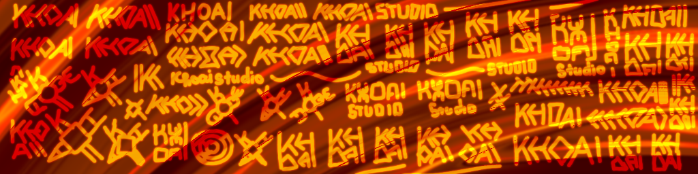

# Mừng bạn về nhà

Phím trước cho người đọc:

- Nhân cách `chúng tôi`: 🤗🥰🙂🤩😚
- Nhân cách `tụi này`: 😏😎😌🤫🤭

## Từ bí đến KHOAI, tụi này là ai?

Chúng tôi là **KHOAI** Studio - một nhóm nhỏ gồm vài thanh niên mê làm game. Không có màn ra mắt hoành tráng, chỉ đơn giản là một nhóm người thích vọc vạch, thử nghiệm và tạo ra thứ gì đó thú vị.

Thành lập vào tháng 5/2025, tuy chưa có game nào ra mắt, nhưng cứ chờ đi, một ngày nào đó bạn sẽ ngập chìm trong những thế giới mà chúng tôi tạo ra.

Còn tên **KHOAI**? Chẳng có gì cao siêu đâu. Lúc nghĩ mãi chưa ra cái tên, tôi buột miệng: *"Khoai thế nhở?"* - vậy là cái tên đó ra đời. Và từ đó, **KHOAI** có thể là khoai, khoái hay khổ ải - tùy vào tâm trạng của tụi này lúc đang code.

## Tầm nhìn

> Tầm nhìn xa trên 10 km vào những ngày quang đãng và giảm xuống dưới 100 m vào những lúc mưa gió. Tịt hẳn nếu có sương mù.

Trước mắt, **KHOAI** Studio tập trung vào làm game - đó là thứ chúng tôi thích và muốn làm thật tốt. Hy vọng sẽ có sản phẩm trước GTA 6.

Còn về lâu dài? Tụi này có thể thử sức với hoạt hình, truyện tranh, hoặc ~~phá sản và tan rã~~ những thứ hoàn toàn khác. Ai mà biết! Cứ để mọi thứ diễn ra tự nhiên, miễn là còn hứng thú thì tụi này vẫn sẽ tiếp tục làm.

## Sứ mệnh

Khiến bạn thấy **khoai, khoái, khổ ải** cùng game của chúng tôi. Không rầm rộ, không rập khuôn, chỉ đơn giản là muốn tạo ra những trò chơi đáng để khám phá.

Và nếu bạn thấy `KHỔÁỈ` (?), thì tốt. Đó chính là ý đồ của tụi này.

---

Bài thuyết trình của ***tụi em*** đến đây là hết, cảm ơn mọi người đã lắng nghe. Mời các nhóm đặt câu hỏi ạ 🥶
